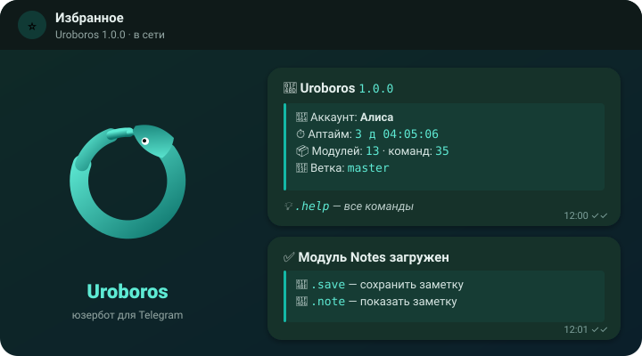

<p align="center">
  
</p>

<h1 align="center">Uroboros</h1>

<p align="center">
  Модульный юзербот для Telegram на Python и Telethon.<br>
  Модули одной командой, кнопки и формы, защита аккаунта от вредного кода.
</p>

<p align="center">
  <a href="https://github.com/asykixd/uroboros/actions/workflows/ci.yml"></a>
  
  
  <a href="LICENSE"></a>
</p>

<p align="center">
  <a href="https://asykixd.github.io/uroboros/"><b>📚 Документация</b></a> ·
  <a href="docs/install.md"><b>🚀 Установка</b></a> ·
  <a href="docs/commands.md"><b>⌨️ Команды</b></a> ·
  <a href="docs/modules.md"><b>🧩 Писать модули</b></a> ·
  <a href="https://github.com/asykixd/uroboros-modules"><b>📦 Модули</b></a>
</p>

<p align="center">
  
</p>

## ✨ Возможности

|  |  |
|---|---|
| 📦 **Модули одной командой** — `.dlm notes`, поиск `.search`, свои репозитории `.addrepo` | 🛡 **Защита аккаунта** — код модуля проверяется до установки, а во время работы модули не видят сессию |
| 🤖 **Кнопки и формы** — встроенный inline-бот: настройки, справка, подтверждения | 🔁 **Совместим с Hikka** — большинство модулей Hikka и FTG работают без правок |
| 🌿 **Стабильная и dev-ветки** — `.dev on` / `.dev off`, обновление `.update` с откатом | 💾 **Бэкапы** — база и модули одним архивом, автобэкап по расписанию |
| 🔐 **Доступ по уровням** — `owner`, `sudo`, `support` и права на каждую команду | 🐧 **Работает везде** — Linux и VPS, Termux, Docker, Windows, macOS |

## 🚀 Установка

Linux, VPS, Termux и macOS:

```bash
curl -fsSL https://raw.githubusercontent.com/asykixd/uroboros/master/install.sh | sh
```

Или через pip: `pip install uroboros-userbot`. Docker, служба systemd, автозапуск в Termux и Windows — в
[документации по установке](docs/install.md).

При первом запуске Uroboros пишет в консоль ссылку на веб-панель входа: откройте её в браузере, введите
`api_id` и `api_hash` с [my.telegram.org/apps](https://my.telegram.org/apps), номер, код и пароль 2FA — или
отсканируйте QR-код. После входа панель выключается, а Uroboros сам создаёт inline-бота для кнопок через
@BotFather. Вход в консоли — `--cli`.

## ⌨️ Главные команды

| Команда | Что делает |
|---|---|
| 📖 `.help [модуль]` | список модулей и справка |
| 📥 `.dlm <ссылка \| owner/repo/модуль \| модуль>` | установить модуль; `.dlm owner/repo` — модули репозитория |
| 🔃 `.uplm [модуль]` | обновить модули: сначала изменения и подтверждение |
| 🗑 `.ulm <модуль>` | удалить модуль |
| ⚙️ `.cfg [модуль]` | настройки модулей — кнопками |
| 🆕 `.update` | обновить Uroboros: список изменений, установка, откат при ошибке |
| 🌿 `.dev on \| off` | перейти на сборку из `dev` или вернуться на стабильную `master` |
| 🔐 `.security` | доступ, права команд, защита от флуда и защита модулей |
| 💾 `.backup`, ♻️ `.restore` | бэкап базы и модулей и восстановление |
| ℹ️ `.info`, 📡 `.ping`, 📝 `.logs` | состояние бота |

Все команды с уровнями доступа — в [справочнике](docs/commands.md).

## 🧩 Пишем модуль

```python
# meta developer: @you
# meta permissions: none
# requires_uroboros: 1.0
from uroboros import Module, command, utils


class Notes(Module):
    """Заметки"""

    @command("save", emoji="💾")
    async def save(self, message):
        """<имя> <текст> — сохранить заметку"""
        name, _, text = utils.get_args_raw(message).partition(" ")
        self.set(name, text)
        await utils.answer(
            message,
            utils.card(
                "✅ <b>Заметка сохранена</b>",
                [f"🏷 Имя: <code>{utils.escape_html(name)}</code>", f"📏 Длина: <code>{len(text)}</code>"],
                hint=f"показать: <code>.note {utils.escape_html(name)}</code>",
            ),
        )
```

В модуле есть `self.client` (Telethon), своё хранилище `self.get`/`self.set`, настройки `self.config`,
фильтры команд, вотчеры, фоновые задачи `@loop`, библиотеки, формы с кнопками `self.inline.form(...)` и
хелперы в `utils`. Подробно — в [руководстве для авторов](docs/modules.md), готовые модули —
в [uroboros-modules](https://github.com/asykixd/uroboros-modules) (это и шаблон для своего репозитория).

## 🛡 Безопасность

> [!WARNING]
> Юзербот работает от имени вашего аккаунта. Спам, массовые рассылки и флуд запросами могут привести к бану —
> сначала проверяйте на втором аккаунте.

Сторонние модули выполняются в одном процессе с ботом. Uroboros проверяет их код при установке, показывает
права и изменения, закрепляет модули с GitHub на коммите и не даёт им трогать сессию и угонять аккаунт. Но это
не песочница — ставьте модули, которым доверяете. Подробнее — в [docs/security.md](docs/security.md).

## 🛠 Разработка

Ветка `dev` — разработка (версии `X.Y.Z-dev`), `master` — стабильные версии.

```bash
python3 -m venv .venv && .venv/bin/pip install -e '.[dev,docs]'
.venv/bin/python -m pytest
.venv/bin/mkdocs serve
```

## 📄 Лицензия

AGPL-3.0, см. [LICENSE](LICENSE).
